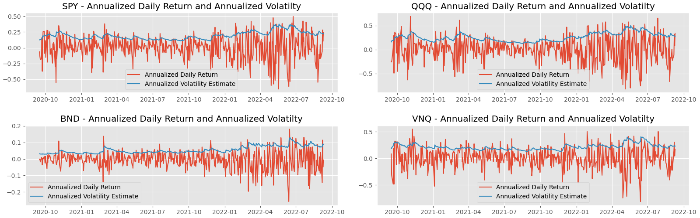
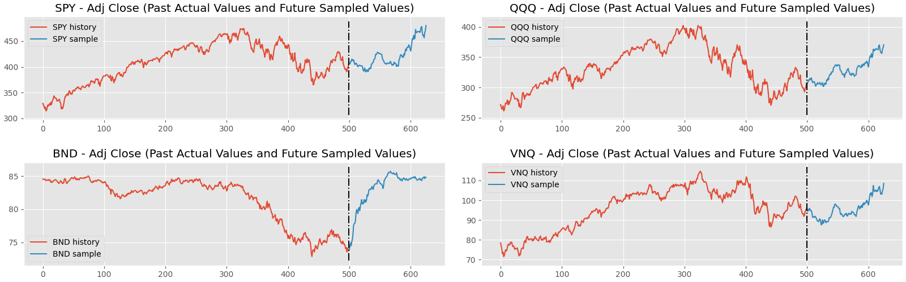

[](https://github.com/mawicks/mvarch/actions/workflows/pythonapp.yml)

# Multivariate Volatility Models (ARCH) for stock prices and other time series)

This package uses a simple model for multivariate (and univariate) volatility (ARCH) models

## Motivation

A number of multivariate volatility models for time series of asset prices
exist in the literature (DCC, VECC, BEKK,  etc.).
This package uses a general specification that includes a number of common models.
Using this package you can generate either a DCC model or a BEKK model.

The model predicts the *distribution* of the log returns for the next trading date.
The actual turn is virtually impossible to predict, but predicting the
distribution of return has several uses:

1. *The distribution can be sampled to generate simulated sequences of returns
   that can be used as synthetic data to test various trading algorithms.*
   Datasets with historic daily returns are very small so testing algorithms using
   historic data is very prone to overfitting.


2. *Knowing the distribution of the daily returns (especially the volatility)
   can be used to determine fair prices for stock options.*  The famous
   Black-Scholes formula predicts fair option prices.  However, it assumes the
   daily returns to be stationary and normally distributed.  However, observed
   daily returns are not stationary (the variance varies with time) and the
   returns are not normally distributed.  They tend to have "long tails"
   compared to a normal distrubution (i.e., kurtosis) and they are not always symmetric
   (i.e., skew).  It's possible to estimate the variances by computing the
   variance of a trailing sample.  However, during periods of increasing
   volatility this would underestimate the volatility since the volatility today
   can be significantly greater than the volatility of the past N days.
   Likewise, during periods of
   decreasing volatility this would overestimate the volatility.  The goal is to
   determine the *instantaneous* volatility to provide estimates of the distribution of
   daily returns during the next trading day (or the next few trading days)

## Usage

### Installation

This package can be installed by running `pip install .` from the top level directory of
a `git clone` checkout, or by running `pip install` and running `pip install and providing
a URL for the github repo, e.g., 

     pip install git+https://github.com/mawicks/mvarch

### Training a model

We will train a model on historic data for a small set of stock symbols.

First import some prerequisites:

```python
# Prerequisites
import mvarch
import numpy as np
import yfinance as yf  # type: ignore
```

Construct a model using `model_factory()`.  Distribution may be 'studentt' or 'normal'.
The mean mode can be 'zero', 'arma', or 'constant'.  It's difficult to estiamte
the daily mean, which is small compared to the daily variance, so a resonable choice is
to model the mean as 'zero'.  Constraints (in increasing order of computational complexity)
may be 'scalar', 'diagonal', 'triangular', or 'none'

```python
model = mvarch.model_factory(distribution="studentt", mean="zero", constraint="none")
```

Download some historic data for the above symbols.

```python
symbols = ("SPY", "QQQ", "BND", "VNQ")
data = yf.download(symbols)

# Grab historic price history for the symbols above
# First dropna() drops rows without data for all symbols.
# Second dropna() drops first day of price history which has no return.
# log1p on the whole thing produces the log returns.
df = np.log1p(data.loc[:, ("Adj Close", symbols)].dropna().pct_change().dropna())
fit_history = df.values

```

Fit the model (This may take a while. Consider reducing the computational complexity
by subsetting the history by, for example, 
`fit_history = df.values[-100:]` or by reducing by modifying the `constraint`
argument in the call to `model_factory()` to be either `scalar` or `diagonal`.)
Note that the log-likelihood reported by the following commanbds is the *mean*
or per-sample log-likelihood averaged over the number of observations.  It
is not the total log-likelihood.

```pythonp
model.fit(fit_history)
print(f"Likelihood: {model.mean_log_likelihood(fit_history):.4f}")
```

If you ran this code on 2022-09-12, you might see something like:

```
Likelihood: 15.2868
```

### Using the model

Run the model on a subset ('tail') of the data for a couple of different use cases
such as
  1. historical volatility over time and next day prediction; and
  2. Forecasting using Monte Carlo simulation.

First 'tail' the data:

```python
evaluate_tail = df.index[-500:]
evaluate_history = df.loc[evaluate_tail].values
```

Run `predict()` on the data subset to make historical predictions and also
next-day predictions. Get correlation, std deviation, and mean estimates for
previous days from history and also for the next business day:

```python
(
    mv_scale_predicted,
    uv_scale_predicted,
    mean_predicted,
    mv_scale_history,
    uv_scale_history,
    mean_history,
) = model.predict(evaluate_history)

# Show predicted next day volatilities and correlations:

print(
    f"Next day volatility prediction (annualized):\n"
    f"{(np.sqrt(252.) * uv_scale_predicted * model.distribution.std_dev()).numpy()}\n"
)

print(
    f"Next day correlation prediction:\n"
    f"{(mv_scale_predicted @ mv_scale_predicted.T).numpy()}"
)

```

If you ran this code on 2022-09-12, you might see something like:
```
Next day volatility prediction (annualized):
[0.24272123 0.30139446 0.08419606 0.2395135 ]

Next day correlation prediction:
[[1.         0.9603142  0.12006433 0.7841618 ]
 [0.9603142  1.         0.14455643 0.7046279 ]
 [0.12006433 0.14455643 1.         0.22765702]
 [0.7841618  0.7046279  0.22765702 0.9999998 ]]
```

A sample plot of historic volatility obtained from this data follows
(code used to construct plots shown in [example.py](/src/mvarch/example.py)):



Get simulated results using a Monte Carlo simulation for the next
`SIMULATION_PERIODS` days, by sampling the model output
for `SIMULATION_SAMPLES` times.  Note that we compute the total
return over the simulation period by using `exp(cumsum)` which is
different from just the sum of the log returns.
The resulting standard deviations and correlations
could be fed into a portfolio optimization routine that chooses an allocation among
the symbols that minimizes the standard deviation subject to some other constraints (e.g., return).

```python

SIMULATION_PERIODS = 126
SIMULATION_SAMPLES = 1000

simulated, mv_scale, uv_scale, mean = model.simulate(
    evaluate_history, SIMULATION_PERIODS, SIMULATION_SAMPLES
)
simulated_returns = np.exp(np.cumsum(simulated.numpy(), axis=1))
# Note: Return value has shape (SIMULATION_SAMPLES, SIMULATION_PERIODS, STOCK_SYMBOLS)

# Calculate the standard deviation of the returns for each variable from the simulation:
std_dev = np.std(simulated_returns, axis=0)[SIMULATION_PERIODS - 1]
# Calculate the correlation coefficiens from the simulation:
corr_coef = np.corrcoef(simulated_returns[:, SIMULATION_PERIODS - 1, :], rowvar=False)
print(
    f"Std dev of total returns over simulation period ({SIMULATION_PERIODS} days):\n{std_dev}\n"
)
print(
    f"Correlation of total returns over simulation period ({SIMULATION_PERIODS} days):\n{corr_coef}"
)

```

If you ran this code on 2022-09-12, you might see something like:

```
Std dev of total returns over simulation period (126 days):
[0.15605381 0.18821143 0.03908034 0.18603522]

Correlation of total returns over simulation period (126 days):
[[ 1.          0.91632208 -0.08541442  0.69823601]
 [ 0.91632208  1.         -0.03951417  0.57860402]
 [-0.08541442 -0.03951417  1.          0.02317722]
 [ 0.69823601  0.57860402  0.02317722  1.        ]]
```

Plots showing historic prices and *simulated* future prices obtained from this data are shown
in the following plots (code used to construct plots is in [example.py](/src/mvarch/example.py)).
Note that SPY and QQQ are strongly correlated 
with one another, VNQ is somewhat correlated with SPY and QQQ,  and BND is not very correlated with the others.
These correlations appear in the historic data as well as the simulated data.




