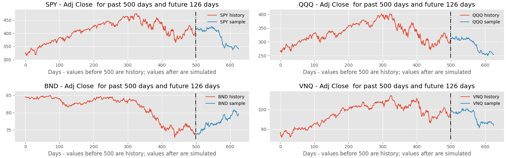

[](https://github.com/mawicks/mvarch/actions/workflows/pythonapp.yml)

# Multivariate Volatility Models (MVARCH) for stock prices and other time series)

This package uses a simple model for multivariate (and univariate)
volatility models similar in principle to univariate (G)ARCH models.

## Motivation

A number of multivariate volatility models for time series of asset
prices exist in the literature (DCC, VECC, BEKK, etc.).  This package
uses a general specification that encompasses a number of common
models.  Using this package you can generate either a DCC model or a
BEKK model.

The model predicts the *distribution* of the log returns for the next
trading date.  The actual daily return (or even the expected value) is
practically impossible to predict, but predicting the volatility of
the daily return has several uses:

1. *The distribution can be sampled to generate simulated sequences of
   returns that can be used as synthetic data to test various trading
   algorithms.* Datasets with historic daily returns are very small so
   testing algorithms using historic data is very prone to
   overfitting.


2. *Knowing the distribution of the daily returns (especially the
   volatility) can be used to determine fair prices for stock
   options.* The famous Black-Scholes formula predicts fair option
   prices.  However, it assumes the daily returns to be stationary and
   normally distributed.  Observed daily returns are not stationary
   (the variance varies with time) and distributions of returns are
   not very normal.  Distributions tend to have "long tails" compared
   to a normal distrubution (i.e., kurtosis) and they are not always
   symmetric (i.e., skew).

Some investors probably estimate volatility by using naive approaches
such as by computing the variance on a trailing sample of returns.
That is not an accurate approach.  During periods of increasing
volatility this would underestimate the volatility since the
volatility today can be significantly greater than the volatility of
the past N days.  Volatility can change rapidly. Likewise, during
periods of decreasing volatility the naive approach would overestimate
the volatility.  By using ARMA approaches, you can determine the
*instantaneous* volatility to provide more accurate estimates of the
distribution of daily returns during the next trading day (or the next
few trading days)

`MVARCH` is a Python package.  You can train a model either by constructing
[a bit of Python code](#training-a-model-in-python),
or by training a model [using a command-line tool](#training-a-model-using-the-command-line-tool)
included in the package.  Making effective use of the model likely
requires [writing some Python code](#using-the-model).

`MVARCH` is implemented in PyTorch, but this is mostly hidden
from the user.  Return values from `MVARCH` methods are PyTorch
tensors that can be converted to `numpy` arrays by calling their
`numpy()` methods.  A user need not know anything about PyTorch.

## Usage

### Installation

`MVARCH` is a Python package which can be installed either by running
`pip install .` from the top
level directory of a `git clone` checkout, or by
running `pip install` and providing a URL for the github repo,
e.g.,

```console
pip install git+https://github.com/mawicks/mvarch
```

### Training a Model in Python

We will train a model on historic data for a small set of stock symbols.

First import some prerequisites:

```python
# Prerequisites
import mvarch
import numpy as np
import yfinance as yf  # type: ignore
```

Construct a model using `model_factory()`.


```python
model = mvarch.model_factory(distribution="studentt", mean="zero", univariate="arch", constraint="none")
```

The `distribution` parameter value may be
`"studentt"` or `"normal"`.  The `mean` model parameter value can be `"zero"`, `"arma"`, or
`"constant"`.  It's difficult to estimate the daily mean, which is small
compared to the daily variance, so a reasonable choice is to model the
mean as `"zero"`.  The `"univariate"` parameter value may be `"arch"` or `"none"`. It determines
whether the marginal volatilities are first estimated in a univariate 'arch' model (the DCC appreach)
with correlations estimated in a multivariate model or whether the volatilities and correlations
are combined into a single multivariate covariance estimate (`"none"`).
The `constraint` parameter value (in increasing order of computational
complexity) may be `"scalar"`, `"diagonal"`, `"triangular"`, or `"none"`.  For a strictly
univariate model (actually a separate univariate model for each asset), set
`multivariate="none"`.

Download some historic data for the above symbols.  The `yfinance` package provides a convenient way to do this:

```python
symbols = ("SPY", "QQQ", "BND", "VNQ")
data = yf.download(symbols)

# Grab historic price history for the symbols above
# First dropna() drops rows without data for all symbols.
# Second dropna() drops first day of price history which has no return.
# log1p on the whole thing produces the log returns.
df = np.log1p(data.loc[:, ("Adj Close", symbols)].dropna().pct_change().dropna())
fit_history = df.values
```

Fit the model (This may take a while. To reduce the time, consider reducing the
computational complexity by subsetting the history by, for example,
`fit_history = df.values[-100:]` or by reducing by modifying the
`constraint` argument in the call to `model_factory()` to be either
`scalar` or `diagonal`.)  Note that the log-likelihood reported by the
following commanbds is the *mean* or per-sample log-likelihood
averaged over the number of observations.  It is not the total
log-likelihood.

```pythonp
model.fit(fit_history)
print(f"Likelihood: {model.mean_log_likelihood(fit_history):.4f}")
```

If you ran this code on 2022-09-19, you might see something like:

```console
Likelihood: 15.2849
```

### Using the Model

Run the model on a subset ('tail') of the data for a couple of different use cases
such as
  1. historical volatility over time and next day prediction; and
  2. Forecasting using Monte Carlo simulation.

First 'tail' the data:

```python
TAIL_SIZE = 500
evaluate_tail = df.index[-TAIL_SIZE:]
evaluate_history = df.loc[evaluate_tail].values
```

Run `predict()` on the data subset to make historical predictions and
also next-day predictions. Note that the return values from `predict()`
and other `MVARCH` functions are PyTorch tensors.  If you prefer working
with `numpy` arrays, you can call a tensor's `numpy()` method to get
a `numpy` array.  Get correlation, std deviation, and mean
*estimates* for the past and *predictions* for the next business day
as follows:

```python
(
    mv_scale_predicted,
    uv_scale_predicted,
    mean_predicted,
    mv_scale_history,
    uv_scale_history,
    mean_history,
) = model.predict(evaluate_history)

# Show predicted next day volatilities and correlations:

print(
    f"Next day volatility prediction (annualized):\n"
    f"{(np.sqrt(252.) * uv_scale_predicted * model.distribution.std_dev()).numpy()}\n"
)

print(
    f"Next day correlation prediction:\n"
    f"{(mv_scale_predicted @ mv_scale_predicted.T).numpy()}"
)

```

If you ran this code on 2022-09-19, you might see something like:

```console
Next day volatility prediction (annualized):
[0.27073285 0.33625355 0.05883523 0.25986665]

Next day correlation prediction:
[[1.         0.9702157  0.10875233 0.8384389 ]
 [0.9702157  1.         0.12562908 0.77586114]
 [0.10875233 0.12562908 1.         0.22840934]
 [0.8384389  0.77586114 0.22840934 0.9999999 ]]
```

A sample plot of historic volatility obtained from this data follows
(code used to construct plots shown in
[example.py](/src/mvarch/example.py)):


Next, get simulated results using a Monte Carlo simulation for the next
`SIMULATION_PERIODS` days, by sampling the model output for
`SIMULATION_SAMPLES` different outcomes.  Note that we compute the total return
over the simulation period by using `exp(cumsum)` which is different
from just the sum of the log returns.  The resulting standard
deviations and correlations could be fed into a portfolio optimization
routine that chooses an allocation among the symbols that minimizes
the standard deviation subject to some other constraints (e.g.,
return).  Again, note that the return values from `simulate()` are
PyTorch tensors, which can be converted to `numpy` arrays by calling
their `numpy()` method:

```python

SIMULATION_PERIODS = 126
SIMULATION_SAMPLES = 1000

simulated, mv_scale, uv_scale, mean = model.simulate(
    evaluate_history, SIMULATION_PERIODS, SIMULATION_SAMPLES
)
simulated_returns = np.exp(np.cumsum(simulated.numpy(), axis=1))
# Note: Return value has shape (SIMULATION_SAMPLES, SIMULATION_PERIODS, STOCK_SYMBOLS)

# Calculate the standard deviation of the returns for each variable from the simulation:
std_dev = np.std(simulated_returns, axis=0)[SIMULATION_PERIODS - 1]
# Calculate the correlation coefficiens from the simulation:
corr_coef = np.corrcoef(simulated_returns[:, SIMULATION_PERIODS - 1, :], rowvar=False)
print(
    f"Std dev of total returns over simulation period ({SIMULATION_PERIODS} days):\n{std_dev}\n"
)
print(
    f"Correlation of total returns over simulation period ({SIMULATION_PERIODS} days):\n{corr_coef}"
)

```

If you ran this code on 2022-09-19, you might see something like:

```console
Std dev of total returns over simulation period (126 days):
[0.19662732 0.2331021  0.03502716 0.22605737]

Correlation of total returns over simulation period (126 days):
[[ 1.          0.86296704 -0.08967935  0.70158927]
 [ 0.86296704  1.         -0.07110933  0.54363716]
 [-0.08967935 -0.07110933  1.          0.02450721]
 [ 0.70158927  0.54363716  0.02450721  1.        ]]
```

Historic prices and *simulated* future prices obtained
from this data are shown in the following plots (code used to
construct the plots is in [example.py](/src/mvarch/example.py)).  Note
that SPY and QQQ are strongly correlated with one another, VNQ is
somewhat correlated with SPY and QQQ, and BND is not very correlated
with the others.  These correlations appear in the historic data as
well as the simulated data.



### Training a Model Using the Command-Line Tool

Instead of writing code as above, you can train models with a command-line tool.  The tool wil train a model
and write the model to a file along with some meta data.  You would still need to write some code to load and use the
model to evaluate it on new data or to generate simulated output.  The command-line tool downloads stock price
history as necessary and caches it in a subdirectory named `training_data` that it creates in the current directory.
This eliminates unnecessary calls to `yfinance`.

For example, the model shown above could be trained using the following command:

```console
python -m mvarch.train --distribution studentt \
                       --mean zero \
		       --univariate arch \
		       --multivariate mvarch \
		       --constraint none\
		       --output output.pt \
                       -s SPY -s QQQ -s BND -s VNQ
```

By default, the tool trains the model on all available history.  You
can also provide start and end dates to define a specific period for
the training data.  You can separately specify start and end dates for
a different time period on which to evaluate the model.  The
command-line tool will show the mean log-likelihood achieved on both
time periods.

For example, the following command trains a model on the same stock symbols over a ten year period
and evaluates the trained model on the next 18 months of data:

```console
python -m mvarch.train --distribution studentt \
                       --mean zero \
		       --univariate arch \
		       --multivariate mvarch \
		       --constraint none \
		       --output output.pt \
                       -s SPY -s QQQ -s BND -s VNQ \
		       --start-date 2011-01-01 --end-date 2020-12-31 \
		       --eval-start-date 2021-01-01 --eval-end-date 2022-06-30
```

Without adequate parameter constraints, these models have a large
number of parameters and can be prone to overfitting.  It's important
to select parameter constraints that produce a model that performs well
on an evaluation period not included in the training data.  Adding constraints
is a form of regularization which enhances generalization.  Choosing either `diagonal`
or even `scalar` constraints on the multivariate model might be a good choice.


